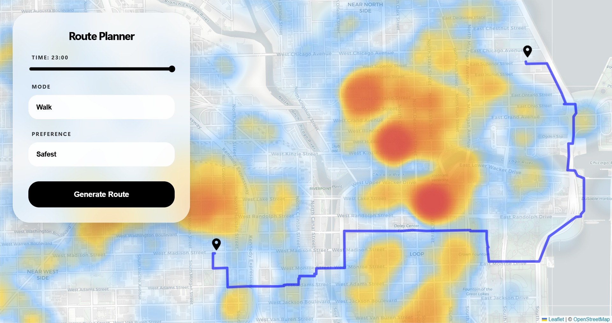
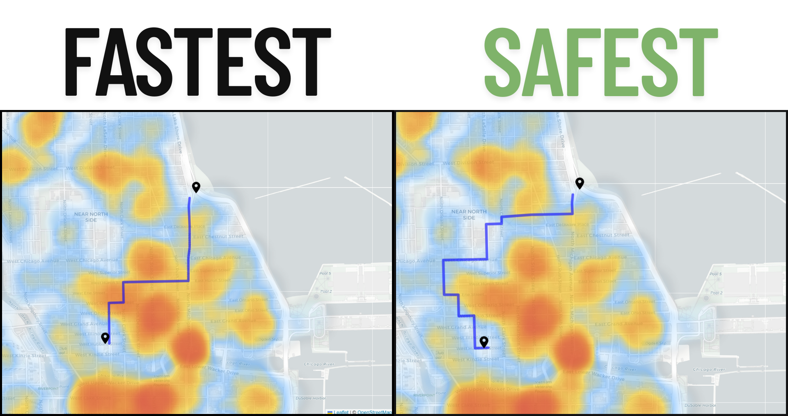

# SafeRouteAI: Navigate Safer, Not Just Faster

## Overview
SafeRouteAI is a full-stack project that helps users move around urban areas more safely. Unlike traditional GPS applications that focus only on speed, this system adds a **risk-aware layer** to route planning. It uses over **259,000 historical incidents** from Chicago to identify risky zones and dynamically adjusts routes based on the time of day. The result is safer routes that remain convenient and avoid unnecessary detours.

---

---

### Key Features
* **Risk-Aware Routes:** Calculates walking or driving paths that avoid areas with higher predicted risk  
* **Time-Sensitive Routing:** Routes adapt depending on the selected hour  
* **Interactive Heatmaps:** Visualizes incident hotspots directly on the map  
* **Safety Options Dropdown:** Allows users to balance safety versus speed  
* **Practical Paths:** Avoids danger without significantly increasing travel distance  

---

## Tech Stack

### Backend
* **Python & FastAPI** – REST API and route computation  
* **Pandas & NumPy** – data preprocessing and feature engineering  
* **Scikit-Learn** – Random Forest risk prediction model  
* **OSMnx & NetworkX** – street graph modeling and routing  
* **Joblib** – ML model serialization  

### Frontend
* **React** – user interface  
* **Leaflet & React-Leaflet** – interactive map visualization  
* **Heatmap Layer** – dynamic hotspot display  
* **Axios** – backend communication  

---

## How the Machine Learning Works
The core of SafeRouteAI is a **Random Forest Classifier** that predicts the risk level of each street segment.

### 1. Data Preparation
* **Source:** Historical incident records (~259k entries) from the public  
  [City of Chicago Data Portal](https://data.cityofchicago.org/)  
* **Preprocessing:**  
  - Extracts **latitude**, **longitude**, and **hour** from timestamps  
  - Removes incomplete records  
* **Synthetic Safe Points:** Randomly generated safe locations are added to balance the dataset, allowing the model to learn the difference between safe and risky areas  

---

### 2. Model Training
* **Features:** Latitude, Longitude, Hour of the day  
* **Target:**  
  - `1` → risky locations (incidents)  
  - `0` → safe locations  
* **Model:** Random Forest Classifier trained with 100 estimators  
* The trained model is saved as `model_risk.pkl` for fast real-time inference  

---

### 3. How Predictions Are Used
* Each street segment is represented as an **edge in a graph**  
* The ML model predicts a **risk score** for each edge based on location and time  
* Edge weights are calculated using:

$$weight = length \times e^{(k \cdot risk\_score)}$$

Where:
- `length` = street length  
- `risk_score` = predicted probability of an incident  
- `k` = safety sensitivity selected by the user  

Shortest-path algorithms then compute the **safest possible route**, balancing safety and distance.

---

## Geospatial Mapping
* The city is modeled as a **graph** using **OSMnx** and **NetworkX**  
* **Dynamic Weights:** Street edges are weighted by both distance and predicted risk  
* **Hotspot Visualization:** Incidents such as thefts, assaults, and other public safety events are displayed as heatmaps  
* Routes dynamically update for different hours, reflecting changing risk patterns  

---

### Fastest vs Safest Route Comparison

### Same Destination, Different Times

---

